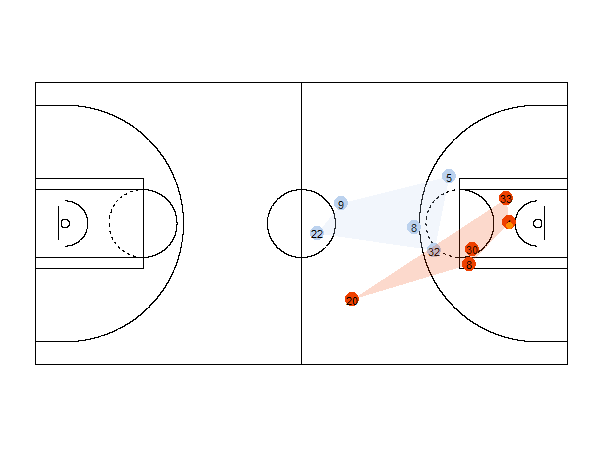

```{r,echo=F,warning=F,message=F}
all.movements <- readRDS("allmovements.RData")
source("https://raw.githubusercontent.com/jalapic/nba/master/playbyplayfunctions.R")
```

This tutorial demonstrates how to create an animated visualization of the [NBA's play-by-play data](http://www.stats.com/sportvu/sportvu-basketball-media/). It heavily builds upon the tutorials written by Rajiv Shah [available here:](http://projects.rajivshah.com/blog/2016/04/02/sportvu_analysis/). I will use several functions available at [Rajiv's GitHub page](https://github.com/rajshah4/NBA_SportVu) to get the data and process it.  I will then get the data into the format required to animate using [gganimate](https://github.com/dgrtwo/gganimate).


### Load these packages
```{r, warning=F,message=FALSE}
library(RCurl)
library(jsonlite)
library(dplyr)
library(sp)
library(ggplot2)
library(data.table)
library(gganimate)
```


### Source Some Functions

First source several functions that we need to extract and plot data. These written by Rajiv and adapted by me. The R file is [available here](https://raw.githubusercontent.com/jalapic/nba/master/playbyplayfunctions.R).


### Get the Data

Although the NBA's play by play data is no longer made publicly available, a selection of these data have been stored.  We will use the data in [this repository](https://github.com/neilmj/BasketballData). I downloaded this  [game-log](https://github.com/neilmj/BasketballData/blob/master/2016.NBA.Raw.SportVU.Game.Logs/12.23.2015.SAS.at.MIN.7z?raw=true") if you want to follow along. I stored it as "0021500431.json" following Rajiv's example.  It is a game between the San Antonio Spurs and Minnesota Timberwolves from December 2015.

Use the 'sportvu_convert_json' function to convert the raw json data to a R dataframe.

```{r, eval=F}
all.movements <- sportvu_convert_json("0021500431.json")
```


The loaded data should look like this:

```{r}
str(all.movements)
```

```{r}
head(all.movements)
```


You can see that the raw data contains infomation about players and the ball. Every row represents the location of a ball or player at a particular time.  Each player is given an ID, a jersey number and position and team-id. They also have an x and y coordinate for each time.  There is additionally radius information related to the ball's movement.

Next, we need to get some metadata for this particular game. The `get_pbp` function grabs this information from the stats.nba.com website.


```{r}
gameid = "0021500431"
pbp <- get_pbp(gameid)
str(pbp)
```

As you can see, this contains loads of stuff that we don't need. Let's just keep what we want:

```{r}
pbp <- pbp[-1,] #first row is NAs
colnames(pbp)[2] <- c('event.id') #will use this to merge on all.movements df
pbp0 <- pbp %>% select (event.id,EVENTMSGTYPE,EVENTMSGACTIONTYPE,SCORE)
pbp0$event.id <- as.numeric(levels(pbp0$event.id))[pbp0$event.id]
head(pbp0)
tail(pbp0)
```

Each event.id refers to a different play in the game. Now we can merge the two files:

```{r}
all.movements <- merge(x = all.movements, y = pbp0, by = "event.id", all.x = TRUE)
dim(all.movements)
```

This is a lot of information! Over 2.6 millions rows.  Let's pick one event id to visualize. Here I will use the same one as Rajiv's example - eventid=303.

```{r}
id303 <- all.movements[which(all.movements$event.id == 303),]
dim(id303)
head(id303)
```

Wow! So much information - this event along as over 10 thousand rows with 77 variables!


### Making a static plot

The first thing to notice is that there are 850 different timepoints in this particular

```{r}
length(table(id303$game_clock))
```

We will extract data to make several dataframes. We will use time 361.15. A different function is used to get the data for the ball, players and the convex hull. 


*Players*

This shows the x and y locations of the 10 players on the court at this time.

```{r}
playerdf <- player_position1(df=id303, eventid=303,gameclock=361.15) 
playerdf
```

*Convex Hull Plot*

This function grabs the points required for plotting the convex hull of the player's location. See [Rajiv's website for more info](http://projects.rajivshah.com/sportvu/Chull_NBA_SportVu.html). 

```{r}
chulldf <- chull_plot(df=id303, eventid=303, gameclock=361.15)
chulldf
```

*Ball Info*

This simply gets the ball information from the id303 dataframe. Notice this dataframe also includes ID and jersey variables (NA). This is so we can bind together with the player location dataframe later.

```{r}
ballposdf <- ball_position1(df=id303, eventid=303, gameclock=361.15)
ballposdf
```


*Plotting*

Next these pieces of information are plotted using ggplot by overlaying it on a geom made by [Ed Kupfer](https://gist.github.com/edkupfer).


```{r}
fullcourt() + 
  geom_point(data=playerdf,aes(x=X,y=Y,group=ID,color=factor(ID)),size=6) +       #players
  geom_text(data=playerdf,aes(x=X,y=Y,group=ID,label=jersey),color='black') +     #jersey number
  geom_polygon(data=chulldf,aes(x=X,y=Y,group=ID,fill=factor(ID)),alpha = 0.2) +  #convex hull
  geom_point(data=ballposdf,aes(x=X,y=Y),color='darkorange',size=3) +             #ball
  scale_color_manual(values=c("lightsteelblue2","orangered2")) +
  scale_fill_manual(values=c("lightsteelblue2","orangered2")) +
  theme(legend.position="none")
``` 
 
 
 
 
 
### Making a dynamic plot

Because the above plot was made using ggplot, it is relatively trivial to make an animated plot by creating the same plot for every time unit and compiling together. This could be done in several ways - I will use gganimate for ease.  

First, I will get the 3 dataframes (player position, convex hull info, ball position) for every time unit of play 303.  I will then put everything into one big dataframe with an extra variable indicating which time unit (timebin) those observations belong to.  To do this, we need to make sure that all 3 dataframes (player position, convex hull info, ball position) need to have the same variables. All that is required is to add a jersey number = NA to the convex hull dataframe.  Lastly, we will add a variable that indicates what dataframe the observations originally come from - this is so we can only plot those data for each step of the ggplot.

Step 1. Store all the clocktimes for this event in ascending order. We will grab the player and ball positions for every unique clock time:

```{r}
clocktimes= rev(sort(unique(id303$game_clock)))
```

Step 2. Now use a for loop to grab player positions, convex hull info and ball position for each time unit.


```{r}
 fulldf=list()

 for(i in seq_along(clocktimes)){
  
  dplayer <- player_position1(df=id303, 303,clocktimes[i]) #Gets positions of players
  dchull <- chull_plot(df=id303, 303,clocktimes[i])       #Gets area of convex hull
  ballpos <- ball_position1(df=id303, 303,clocktimes[i])  #Gets position of ball
  dchull$jersey = "NA"
  dplayer$valx = 'player'
  dchull$valx = 'hull'
  ballpos$valx  = 'ball'
  fulldf[[i]] = rbind(dplayer,dchull,ballpos)
}

 length(fulldf)  #850 elements

 fulldf = Map(cbind,fulldf,timebin=1:length(fulldf))  #add time unit 

```
 


A few things to notice...  The number of rows of this dataframe are not all the same.

```{r}
table(lapply(fulldf,nrow) %>% unlist)
```

This is primarily because the convex plot sometimes has a different number of rows.  However, two timebins have ridiculously large number of observations...
   
```{r}
which(lapply(fulldf,nrow) %>% unlist   > 23)
```

The timeunit = 1 is when the game clock is stopped as the ball is entering play. The players are running all over the place. I will not plot this here.  464 actually refers to the end of this particular play and similarly the ball and tracking data picks up on a lot of different info.  Therefore, I will actually just plot the events 2-463.


```{r}
playdf = data.table::rbindlist(fulldf)
playdf2 = playdf %>% filter(timebin!=1) %>% filter(timebin<464)
```


Now we can use the gganimate syntax to create a ggplot object. We add a "frame=" argument, telling it that we want to compile separate images over the timebin variable. We store this as "p".

```{r}
p = fullcourt() + 
  geom_point(data=playdf2 %>% filter(valx=="player"),aes(x=X,y=Y,group=ID,color=factor(ID),frame=timebin),size=6) +
  geom_text(data=playdf2 %>% filter(valx=="player"),aes(x=X,y=Y,group=ID,frame=timebin,label=jersey),color='black') +
  geom_polygon(data=playdf2 %>% filter(valx=="hull"),aes(x=X,y=Y,group=ID,fill=factor(ID),frame=timebin),alpha = 0.2) + 
  geom_point(data=playdf2 %>% filter(valx=="ball"),aes(x=X,y=Y,frame=timebin),color='darkorange',size=3) +
  scale_color_manual(values=c("lightsteelblue2","orangered2")) +
  scale_fill_manual(values=c("lightsteelblue2","orangered2")) +
  theme(legend.position="none")
```

Next, we use gganimate to save the file as a gif to our working directory. You could tweak the interval parameter to improve the flow.  This ~~might~~ will take some time depending on your machine's umph:

```{r,eval=FALSE}
gg_animate(p, "nbaplot.gif", title_frame =F, ani.width = 600, ani.height = 450, interval=0.1)  
```





I hope this helps inspire you to play around with these data and make animated plots. Theoretically any spatiotemporal data could be plotted using this method.  If you can improve on this method or have any suggestions - please let me know by email jc3181 AT columbia DOT edu or on [twitter](https://twitter.com/jalapic).


